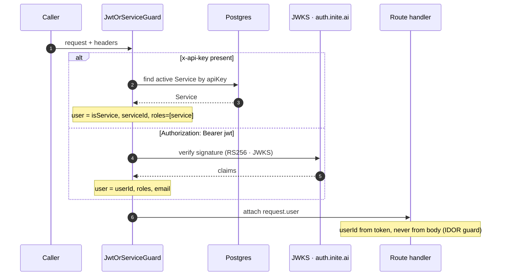

# API reference

> The rendered version (with diagrams) lives at
> [billing.inite.ai/docs/api](https://billing.inite.ai/docs/api). For task-oriented
> walkthroughs, see the [guides](https://billing.inite.ai/docs/quickstart).

REST only, everything under `/v1/*` except provider webhooks and `/health`.
Interactive Swagger lives at `/api` (non-production). This page is the
orientation map; exact request/response shapes are in Swagger.

## Authentication

Two principals, three guards:

| Caller | How | Guard behavior |
|---|---|---|
| **End user** | `Authorization: Bearer <jwt>` (issued by auth.inite.ai; RS256 via JWKS, HS256 fallback for dev) | `userId` always comes from the token — endpoints ignore user IDs in params/body for non-service callers (IDOR guard) |
| **INITE module (service)** | `x-api-key: <Service.apiKey>` (created in admin UI, revocable) | May act on behalf of any user; `serviceId` is auto-injected from the key |

`JwtOrServiceGuard` picks the principal from the headers: an `x-api-key` is resolved to an active
`Service`, otherwise the `Bearer` JWT is verified against the JWKS. Either way, `userId` for
user-scoped reads comes from the token — never from the request body.



```bash
# User
curl -H "Authorization: Bearer <jwt>" http://localhost:3000/v1/orders/me

# Service-to-service
curl -H "x-api-key: sk_..." http://localhost:3000/v1/credits/consume -d '...'
```

Admin endpoints additionally require the `admin` role in the JWT.

## Surface map

### Catalog & checkout

| Endpoint | Auth | Notes |
|---|---|---|
| `GET /v1/products` | optional service key | Active products (service-scoped when key present) |
| `GET /v1/products/prices?product_code=` | optional service key | Prices |
| `GET /v1/products/search?q=` | optional service key | Semantic search (pgvector; ILIKE fallback) |
| `POST /v1/checkout/sessions` | JWT or service | Create session; `idempotency-key` header supported |
| `GET /v1/checkout/sessions/:id` | JWT or service | Session details incl. payment methods |
| `POST /v1/checkout/sessions/:id/pay` | JWT or service | Pay (promo applied inside this transaction) |
| `POST /v1/checkout/validate-promo` | JWT or service | Dry-run promo validation |

### Orders, subscriptions, entitlements

| Endpoint | Auth |
|---|---|
| `GET /v1/orders/me`, `GET /v1/orders/:id` | JWT |
| `GET /v1/subscriptions/me`, `POST /v1/subscriptions/cancel`, `POST /v1/subscriptions/resume`, `POST /v1/subscriptions/trial` | JWT |
| `GET /v1/subscriptions/user/:userId` | service |
| `GET /v1/entitlements/me` | JWT |
| `GET /v1/entitlements/:userId` | service |

### Credits & metering

| Endpoint | Auth | Notes |
|---|---|---|
| `GET /v1/credits/me`, `GET /v1/credits/me/usage` | JWT | Balances, ledger history |
| `GET /v1/credits/me/usage/breakdown?groupBy=feature\|day` | JWT | Metered usage analytics |
| `GET /v1/credits/features` | JWT or service | Active feature registry (codes, units, rates) |
| `POST /v1/credits/consume` | JWT or service | **Two modes**: flat `{userId, amount}` (legacy, unchanged) or metered `{userId, featureCode, units, modelTier?}` — quota-enforced, returns `creditsCharged`; hard cap → `200 {success:false, error:"Quota exceeded", quota:{...}}` |
| `POST /v1/credits/adjust` | service only | Signed adjustment |
| `GET /v1/credits/:userId` | service | Balance lookup |

### Assistant & conversations

| Endpoint | Auth | Notes |
|---|---|---|
| `POST /v1/assistant/chat` | JWT | SSE — AI SDK v7 UI Message Stream (`x-vercel-ai-ui-message-stream: v1`); throttled 10/min |
| `POST /v1/assistant/generate-features` | JWT | One-shot product-copy generation |
| `GET /v1/assistant/actions?conversationId=` | JWT | List action proposals |
| `POST /v1/assistant/actions/:id/confirm` / `:id/reject` | JWT | Execute/decline a proposal; owner-only, role re-checked; double-confirm → 409 |
| `GET/POST /v1/conversations...` | JWT or service | History CRUD (ownership-checked) |
| `POST /v1/conversations/:id/messages/:messageId/feedback` | JWT | 👍/👎 + optional comment on assistant messages |

### Notifications

| Endpoint | Auth |
|---|---|
| `GET /v1/notifications/me`, `GET /v1/notifications/me/unread-count` | JWT |
| `POST /v1/notifications/me/read` `{ids?\|all}` | JWT |
| `GET/PUT /v1/notifications/me/preferences` | JWT |
| `POST /v1/notifications/unsubscribe` `{token, category?}` | public (email links) |
| `POST /v1/notifications/webhooks/resend` | svix signature | Delivery status; bounce/complaint → contact suppression |

### Recommendations

| Endpoint | Auth |
|---|---|
| `GET /v1/recommendations/me?surface=&limit=` | JWT |
| `GET /v1/recommendations/checkout/:sessionId` | JWT or service |
| `GET /v1/recommendations/:userId` | service |

### Affiliates

`/v1/affiliates/me/{stats,referrals,commissions,payouts,balance,withdraw,tree}` (JWT) —
self-service affiliate accounts, referral links, NET-15 payouts.

### Admin (`/v1/admin/*`, role `admin`)

~80 endpoints. Notable groups: services (API-key reveal/rotation), products,
prices, orders (refund), subscriptions (force-cancel), customers,
entitlements, credits, affiliates + referral levels, payout/payment
providers, promo codes, funnel analytics
(`funnel/{pipeline,metrics,timeseries,abandoned}`), plus:

| Group | Endpoints |
|---|---|
| Metering | `GET/POST/PUT/DELETE /v1/admin/metering/{features,quotas}`, `GET /v1/admin/metering/usage` |
| Outreach | `GET /v1/admin/outreach`, `/stats`, `/:id`, `POST /test-email` |
| Risk | `GET /v1/admin/risk/{flagged,stats}`, `POST /v1/admin/risk/:id/review` (`{resolution: ok\|fraud, refund?}`) |
| AI insights | `POST /v1/admin/insights/funnel` (cached 6h, `force` to regenerate) |

### Provider webhooks (public, signature/shared-secret per rail)

`POST /webhooks/{one,lava,stripe,apple,google,crypto}`

## Outbox events (billing → your service)

Every active `Service` with a `webhookUrl` receives all `billing.*` events as
HTTP POST (headers `x-service-code`, `x-event-type`, `x-event-id`):

```
billing.payment.{status_changed,succeeded,failed,refunded}
billing.entitlement.{granted,revoked}
billing.subscription.{updated,payment_failed,cancelled,ended,trial_started}
billing.affiliate.payout.created
billing.quota.warning
billing.risk.flagged
```

## Examples

Create a checkout session:

```bash
curl -X POST http://localhost:3000/v1/checkout/sessions \
  -H "Authorization: Bearer <jwt>" \
  -H "Content-Type: application/json" \
  -H "idempotency-key: unique-key-123" \
  -d '{"priceCode": "club_member_monthly", "mode": "SUBSCRIPTION"}'
# → { "sessionId": "...", "checkoutUrl": "https://billing.inite.ai/checkout/..." }
```

Metered credit consume (from an INITE module):

```bash
curl -X POST http://localhost:3000/v1/credits/consume \
  -H "x-api-key: sk_..." -H "Content-Type: application/json" \
  -d '{"userId": "u-123", "featureCode": "ai.chat.tokens", "units": 15000, "modelTier": "haiku"}'
# → { "success": true, "remainingBalance": 940, "creditsCharged": 4 }
```

## Contract stability

Machine-to-machine endpoints are consumed by every INITE module: response
shapes only ever **grow** (strict supersets), request fields are added as
optional, error semantics don't change (`consume` returns
`200 {success:false}` for both insufficient credits and quota hits — it never
started throwing). Breaking changes require a `/v2` route.
