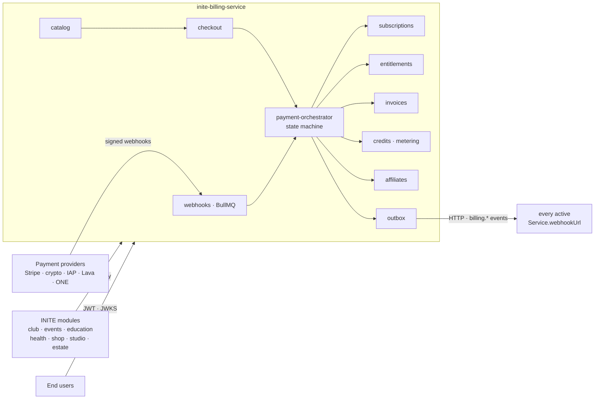
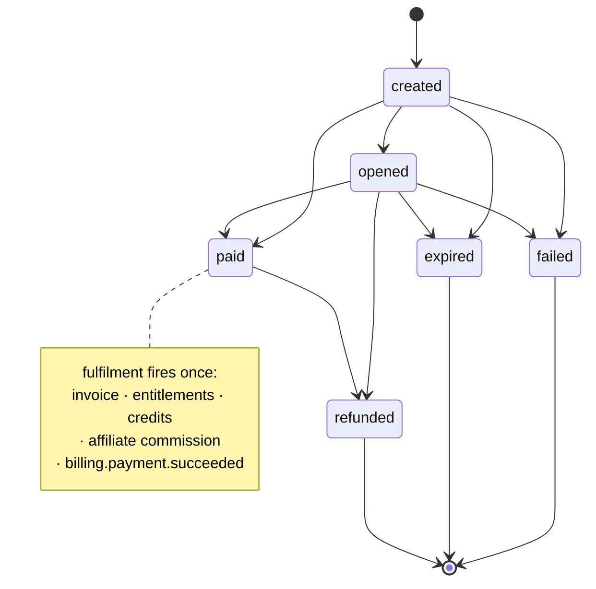
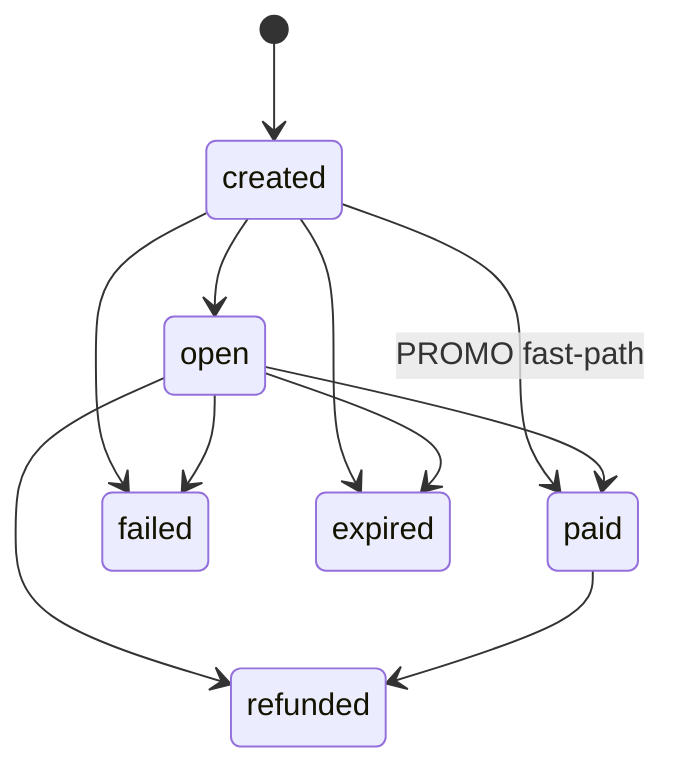
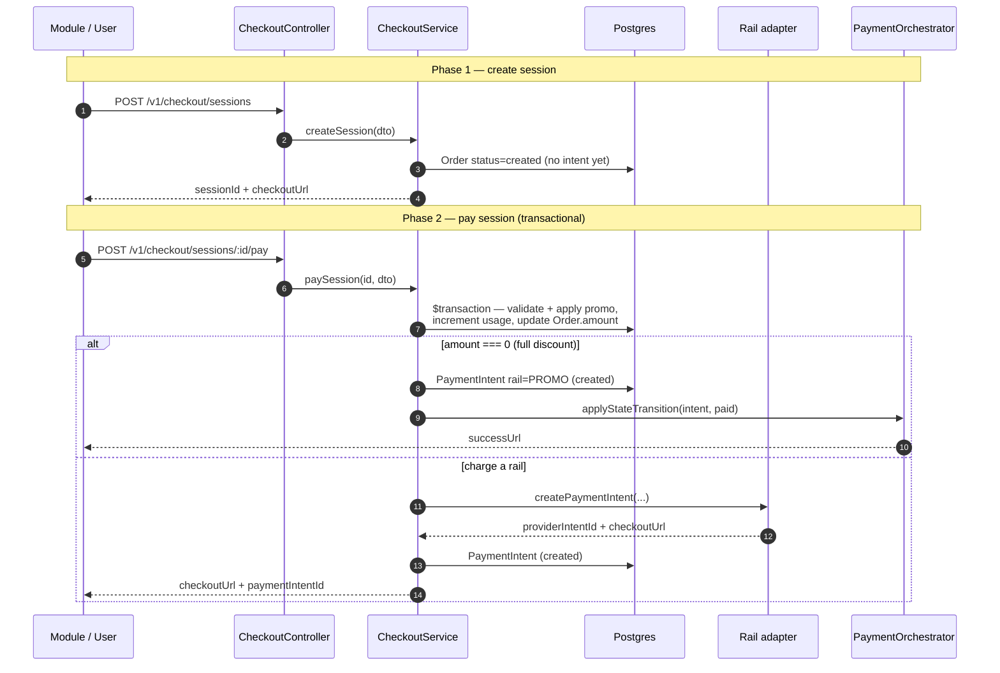
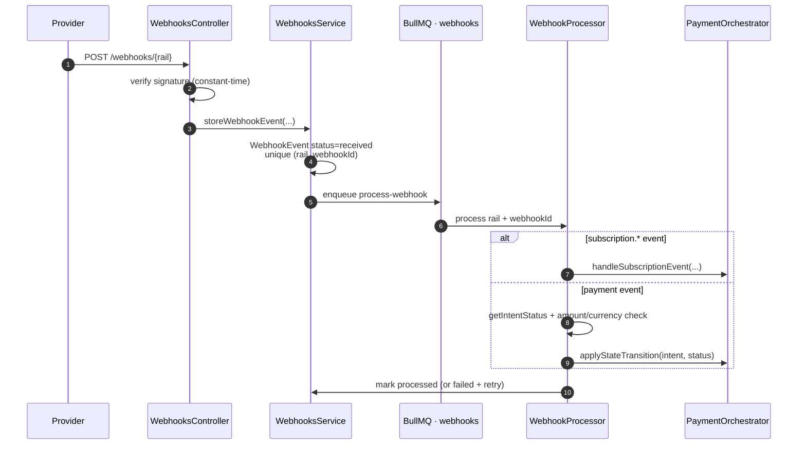
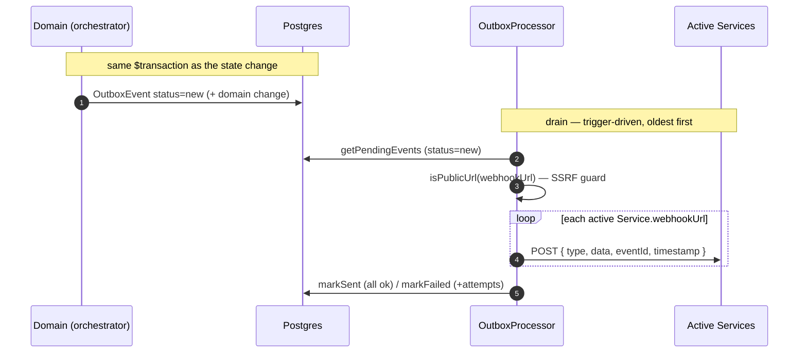
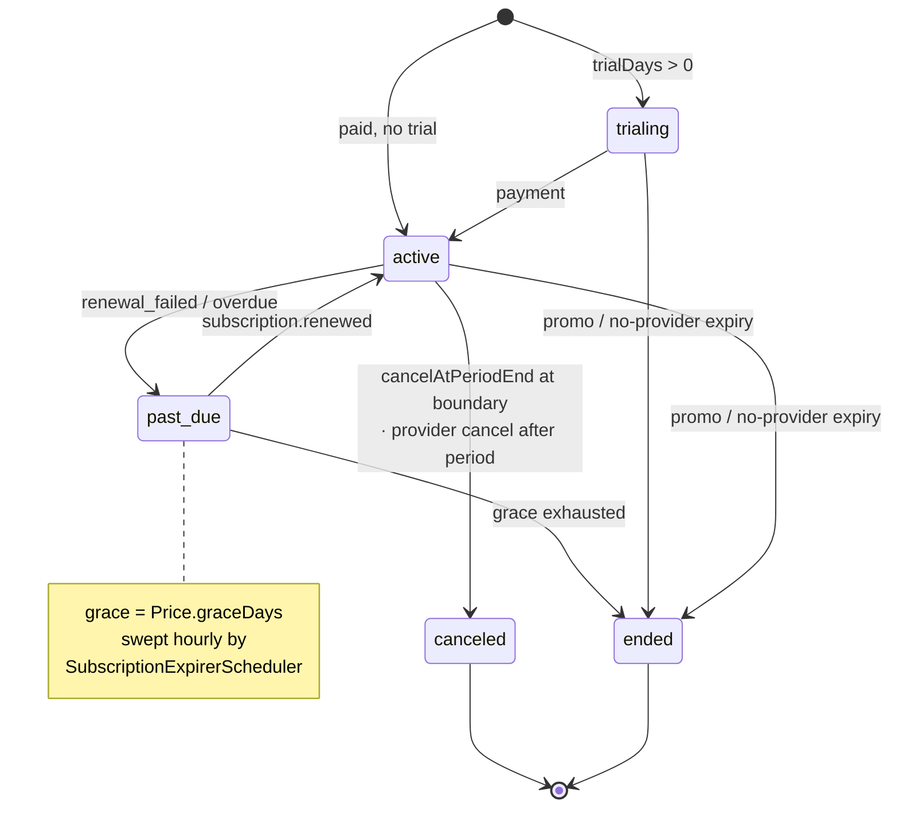
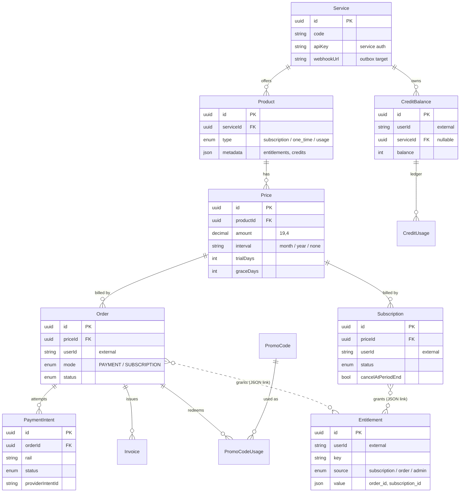

# Architecture

> The always-current version with rendered diagrams lives at
> [billing.inite.ai/docs/architecture](https://billing.inite.ai/docs/architecture).

INITE Billing is a NestJS 11 backend (Express 5) with a Next.js frontend, PostgreSQL
(Prisma 5, everything in the `billing` schema) and Redis/BullMQ for background work. It is the
single money gateway for INITE platform modules, which call it machine-to-machine with an
`x-api-key`; end users authenticate with JWTs from `auth.inite.ai`.

## System context

## Module map (`src/`)

| Module | Responsibility |
|---|---|
| `payment-orchestrator/` | The core state machine. `applyStateTransition(intent, status)` drives every side effect: order status, subscription creation/renewal, entitlement grant/revoke, credit grants, invoices, funnel events, outbox emits. All money movement goes through it. |
| `adapters/` | `PaymentRailAdapter` implementations: `one`, `stripe`, `lava`, `crypto` (ETH/SOL/TON/TRON), `apple-iap`, `google-play`. Registered in `main.ts`; credentials live in `payment_providers.config` (DB), not env. |
| `catalog/` | Products/prices per service; semantic search endpoint (`/v1/products/search`). |
| `checkout/` | Two-phase checkout: `createSession` (order `created`, risk-scored) → `paySession` (payment intent via adapter; promo application happens **only** inside this transaction). |
| `webhooks/` + `workers/webhook.processor.ts` | Provider webhooks land in `webhook_events` (unique per `(rail, webhook_id)`), processed via BullMQ with amount/currency validation before the state transition. |
| `outbox/` + `workers/outbox.processor.ts` | Transactional outbox: `billing.*` domain events broadcast by HTTP POST to every active `Service.webhookUrl` (SSRF-guarded, private IPs rejected). |
| `subscriptions/` | Lifecycle: `trialing → active → past_due (grace = Price.graceDays) → ended`; an hourly expirer revokes entitlements at period end. |
| `credits/` | Ledger (`CreditBalance` per userId+serviceId, typed `CreditUsage`) + `MeteringService`: feature registry, model-tier rates, windowed quota evaluation inside the consume transaction (row-locked). |
| `entitlements/` | Access rights: granted on payment, revoked on refund/expiry. |
| `affiliates/` | Multi-level referral program: configurable `ReferralLevel` commission tiers, NET-15 payout generation, payout providers. |
| `promo-codes/` | Percentage/fixed discounts, usage limits, validity windows. |
| `funnel/` | `FunnelEvent` journey (awareness → churned). 15-min cron detects abandoned checkouts and churning subscriptions; powers admin analytics and outreach triggers. |
| `notifications/` | Channel layer: Resend email (BullMQ queue, retries, delivery webhooks, unsubscribe + suppression) and in-app notifications; per-category preferences; `UserContact` captured lazily from JWT email + locale header. |
| `outreach/` | AI retention engine: trigger scheduler → LLM generation (template fallback) → notify → conversion attribution. See [ai-features.md](ai-features.md). |
| `assistant/` + `conversations/` | Claude chat over the AI SDK v7 stream protocol (UI Message Stream, wire version `v1`); role-gated tools; `actions/` sub-layer for confirm-gated writes; telemetry in `assistant_tool_calls`. |
| `rag/` | pgvector product embeddings (OpenAI `text-embedding-3-small`), semantic product search, pg_trgm fuzzy order search. |
| `recommendations/` | Rule-based next-best-offer (upgrade / abandoned / cross-sell / co-purchase / top-seller) with optional LLM explanations. |
| `risk/` | Heuristic checkout risk scoring; monitor-only unless `RISK_BLOCKING_ENABLED`. |
| `insights/` | AI narrative over funnel metrics, cached 6h per scope. |
| `admin/` | Admin REST (`/v1/admin/*`); new surfaces live in separate controllers (metering, risk, outreach, insights). |
| `auth/` | JWT strategy (HS256/RS256 via JWKS); guards: `JwtAuthGuard`, `ServiceAuthGuard`, `JwtOrServiceGuard`, `RolesGuard`. `RequestUser = { userId, roles[], email?, isService?, serviceId? }`. |
| `common/anthropic/` | Shared Anthropic client (`ANTHROPIC_CLIENT` DI token) + model config from env. Every LLM consumer injects this — model IDs are never hardcoded. |

## Payment state machine

`applyStateTransition(paymentIntentId, status)` runs inside a single `$transaction`, validates the
edge (invalid transitions throw), and re-applying the current state is a no-op. The
**PaymentIntent** is the source of truth; the **Order** status is a projection of it.

The Order status is derived from the intent (`created→created`, `opened→open`, `paid→paid`,
`refunded→refunded`, `failed→failed`, `expired→expired`):

Side effects fire exactly once per transition:

- `paid` → order paid, subscription created/renewed, entitlements granted, credits granted
  (`Product.metadata.creditsPerPeriod` / `.credits`), invoice written, affiliate commission
  recorded, `billing.payment.succeeded` emitted, funnel `payment_completed` tracked.
- `refunded` → entitlements revoked, credits refunded, affiliate commissions voided,
  `billing.payment.refunded` emitted.
- `failed` / `expired` → funnel `payment_failed`, risk failure signal recorded;
  `billing.subscription.payment_failed` for renewals (dunning picks it up).

## Checkout flow

Two-phase so the order exists (and can be risk-scored, funnel-tracked and abandoned-recovered)
before any payment intent is created. **Promo application and intent creation happen only in
phase 2**, inside one transaction that atomically increments promo usage under a
`WHERE currentUsageCount < max` guard.

## Event flows

**Inbound — provider webhooks.** Each provider posts to a per-rail endpoint that verifies the
signature in constant time, persists a `WebhookEvent` (idempotent on `(rail, webhookId)`), and
enqueues a BullMQ job. The processor validates amount and currency **before** applying the state
transition.

**Outbound — transactional outbox.** Domain code writes an `OutboxEvent` in the *same* transaction
as the state change, so an event is never emitted for a change that rolled back. Delivery to each
active service webhook is guarded by an SSRF check that rejects private/link-local hosts.

## Subscription lifecycle

New subscriptions start `trialing` when the price has trial days, else `active`. Renewals arrive as
provider webhooks (`subscription.renewed` synthesises a paid order and reuses the fulfilment path).
The **hourly** `SubscriptionExpirerScheduler` reconciles what providers don't tell us: it pushes
overdue provider-backed subs to `past_due`, opens the grace window (`Price.graceDays`), and ends
them if grace is exhausted.

## Data model

24+ Prisma models, all in the `billing` schema, snake_case columns via `@map`, uuid PKs,
`Timestamptz(6)`. Money is `Decimal(19,4)` — never floats; credits are integers. `userId` is an
external string (no local User table — identity lives in `auth.inite.ai`); `Entitlement` links to
its source order/subscription softly, through its `value` JSON rather than a foreign key.

Other model groups on top of that spine:

- Events: `WebhookEvent` (in), `OutboxEvent` (out), `FunnelEvent` (journey).
- Credits: `CreditBalance`, `CreditUsage` (+ `featureCode`/`units`/`modelTier`), `MeteredFeature`, `FeatureQuota`.
- AI: `Conversation`, `ChatMessage`, `AssistantToolCall`, `AssistantAction`, `ProductEmbedding` (vector 1536), `AiInsight`.
- Retention: `Notification`, `UserContact`, `NotificationPreference`, `OutreachMessage` (unique `triggerKey`), `RiskAssessment`.
- Affiliates: `Affiliate`, `Referral`, `ReferralLevel`, `AffiliateCommission`, `AffiliatePayout`.

Migrations are append-only (`prisma/migrations/NNNN_*`) — never edit a shipped migration.

## Background workers (BullMQ + cron)

| Worker | Queue / schedule | Job |
|---|---|---|
| `webhook.processor` | `webhooks` | Validate + apply provider webhooks |
| `outbox.processor` | `outbox` | Deliver `billing.*` events to service webhooks |
| `notification-email.processor` | `notifications` | Render + send email via Resend (5 attempts, exp backoff) |
| `outreach.processor` | `outreach` | Generate + send retention messages (concurrency 2 — bounds LLM spend) |
| `product-embedding.processor` | `embeddings` | Embed products on create/update; nightly reconcile |
| `subscription-expirer` | cron · hourly | past_due grace handling, period-end expiry |
| `funnel` automation | cron · `*/15m` | Detect abandoned checkouts, churning subs, stale-order cleanup |
| `outreach-triggers` | cron · `*/15m +5m` | Enqueue outreach for funnel signals (idempotent via `triggerKey`) |
| affiliate payouts | cron · daily | NET-15 payout generation |

## Idempotency

- Checkout creation — `idempotency-key` header.
- Webhook processing — unique `(rail, webhook_id)`.
- State transitions — no-op when already in the target state.
- Outbox — event written in the same transaction as its change; delivery is retried, never duplicated for a rolled-back change.
- Outreach — DB-unique `triggerKey` (+ BullMQ jobId + Resend `Idempotency-Key`).
- Metered credit consume — balance row lock (`SELECT ... FOR UPDATE`) serializes concurrent quota evaluation.
- Assistant action confirm — CAS `pending → executing` (`updateMany`); the race loser gets a 409 with the winner's outcome.
