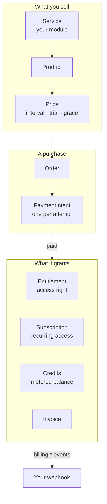

export const metadata = {
  title: 'Core concepts',
  description: 'The mental model behind INITE Billing — the objects you work with and how a purchase turns into access.',
  alternates: { canonical: '/docs/concepts' },
}

# Core concepts

INITE Billing is the single money gateway for the INITE platform. Your module never talks to
Stripe, crypto, or an app store directly — it talks to Billing, and Billing turns a payment into
the thing your product actually cares about: **access**. This page is the mental model; the
[guides](/docs/quickstart) put it to work.

## Two callers

Every request is one of two principals (see the [API reference](/docs/api) for the guard):

- **Your module**, machine-to-machine, with `x-api-key: <Service.apiKey>`. It may act on behalf
  of any of its users.
- **An end user**, with a JWT from `auth.inite.ai`. Their `userId` always comes from the token —
  never from a request body — so a user can only ever act on their own data.

`userId` is an opaque external string. Billing has no user table of its own; identity lives in
`auth.inite.ai`.

## The objects

**Catalog — what you sell.** A `Service` (your module) owns `Product`s; each `Product` has one or
more `Price`s. The Price carries the commercial terms: amount and currency, `interval`
(`month` / `year` / `none`), `trialDays`, and `graceDays`. You reference a price by its code at
checkout.

**Purchase — what happens when someone buys.** Checkout creates an `Order`, and paying it creates
a `PaymentIntent` (one per attempt, on a specific rail). The [payment
orchestrator](/docs/architecture#payment-state-machine) is the single state machine every intent
passes through — when it reaches `paid`, all fulfilment fires exactly once.

## Three ways a purchase grants value

A paid order can grant any combination of these. Choosing the right one is most of the design:

| Grant | What it is | Reach for it when |
|---|---|---|
| **Entitlement** | A boolean access right (`key`, `status`), granted on payment, revoked on refund/expiry | "Does this user have access to feature X / tier Y?" |
| **Subscription** | Recurring access with a period, trial, grace, and renewal lifecycle | Access should recur and lapse if payment stops |
| **Credits** | An integer balance you debit as usage happens, with model-tier rates and quotas | Usage-based / pay-as-you-go, especially [AI metering](/docs/metering-credits) |

Entitlements answer *can they?*, credits answer *how much have they used?*, and subscriptions tie
either to a recurring bill. A single product often grants several — e.g. a subscription that also
resets a monthly credit balance and flips an entitlement.

## Money and events

- **Money is `Decimal(19,4)`** end to end — never floats. **Credits are integers.**
- Everything your module needs to know is pushed to you as a [`billing.*`
  event](/docs/webhooks): a payment succeeded, an entitlement was granted or revoked, a
  subscription changed. You react to those rather than polling.

## Where to go next

- [Sell your first subscription](/docs/quickstart) — the end-to-end happy path.
- [Meter AI usage with credits](/docs/metering-credits) — usage-based billing.
- [Gate access with entitlements](/docs/entitlements) — the access-control pattern.
- [Receive billing events](/docs/webhooks) — wire up your webhook.
