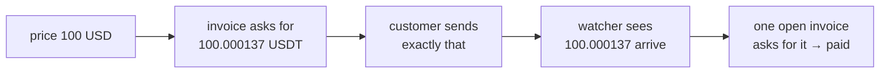

export const metadata = {
  title: 'Accept stablecoins',
  description:
    'USDT and USDC on TRON, TON, Ethereum and Solana, paid straight into your own wallets — how invoices are recognised, confirmed and reconciled.',
  alternates: { canonical: '/docs/crypto' },
}

# Accept stablecoins

Customers pay USDT or USDC straight into your own wallets. No processor holds the money and none
takes a cut. The service watches the chains, recognises each payment, and settles the order
through the same state machine as every other rail.

| Network | Tokens | Final after |
|---|---|---|
| TRON (TRC-20) | USDT | 19 confirmations (≈ 1 min) |
| TON | USDT | committed block (≈ 5 s) |
| Ethereum (ERC-20) | USDT, USDC | 12 confirmations (≈ 3 min) |
| Solana (SPL) | USDT, USDC | finalized (≈ 15 s) |

Prices can be in **any currency**. A stablecoin is a dollar, so a price in roubles, euros or
tenge is converted when the invoice opens, and that rate is fixed for the invoice — see
[exchange rates](#exchange-rates).

## How a payment is recognised

A USDT transfer on TRON or Ethereum carries a sender, a receiver and an amount — nothing else.
There is no memo field to say which order it pays. So with one receiving wallet, **the amount is
the identifier**:



Each invoice asks for the price plus a few millionths — under a cent — and keeps that amount to
itself until it is paid or can no longer be. A partial unique index in the database guarantees
no two open invoices ever share one, even when two checkouts race for the same price.

The checkout shows the amount with the identifying digits set apart, a copy button, a QR code (an
EIP-681 / Solana Pay / `ton://` link where the chain has a standard), a countdown, and a warning
naming the network.

## Set it up

In **Admin → Crypto payments**:

1. **Wallets** — paste a receiving address per network. Each is checked as an address on its
   own network (checksums included) before it is saved; a network left empty is not offered.
2. **Chain access** — TRON, TON and Solana work without keys at low volume; a key raises the
   rate limits. Ethereum needs an Etherscan API key. Keys are stored write-only.
3. **Turn on.** The rail refuses to turn on with no network it can actually watch.

The page says per network whether it is accepting payments, and when the watcher last checked.

## Exchange rates

A price in any currency other than USD is converted to dollars when the invoice opens:

```
9 000 RUB ÷ 90 RUB per $1 = $100   → + 2% markup = $102   → invoice asks for 102.000137 USDT
```

- **Rates** come from open.er-api.com (160+ currencies, daily), falling back to the Central
  Bank of Russia (the rouble, plus cross rates through it). They are stored and refreshed hourly.
- **Pinned rates** win over both — for a rate you set yourself, e.g. what USDT actually costs you in
  roubles rather than the official dollar rate.
- **Markup** (0–20 %, default 0) is added to converted prices only, never to a dollar price. It
  covers the gap between a reference rate and what dollars cost you, and movement while the
  invoice is open.
- The amount is **rounded up** to the token's smallest unit: the customer covers the last fraction,
  the shop is never short by it.
- The rate used, its source, the markup and the original price are **recorded on the invoice** and
  shown to the customer under the amount.
- A currency with **no rate published in the last four days** is not offered crypto at all, rather
  than charged at a stale rate.

Set the markup, pin rates and see the rate each of your currencies will be charged at in
**Admin → Crypto payments → Exchange rates**.

## The watcher

Every 30 seconds, for each network and token with an open invoice, the watcher asks that chain's
public API for recent incoming transfers — TronGrid, Toncenter, Etherscan, Solana RPC. An idle
shop makes no calls at all.

Each transfer is recorded once, idempotently, and:

- **matches an open invoice** → the invoice moves to *confirming*, then *paid* when final. Each
  step becomes an ordinary webhook event, so settlement goes through the same processor,
  reconciliation and state machine as Stripe or an app store.
- **matches nothing** → it is kept as an **unmatched transfer** for an admin, never dropped.

Before an intent is reported paid, the transfer is checked against its invoice: our wallet, the
right chain and token, at least the invoiced amount.

## Deadlines and late money

An invoice counts down (60 minutes by default). When the timer runs out the customer can get a
new invoice — but a payment that arrives late is **still credited** for a grace period (24 hours
by default), because the amount stays reserved. A blockchain transfer cannot be declined, so
turning late money away would only move the problem to a support ticket.

After the grace period an unpaid invoice expires, and its order with it.

Switching network at checkout replaces the invoice — the old one's address and amount are wrong
for what the customer is about to send — and gives its amount back. Once a transfer has been
seen, the invoice cannot be replaced.

## Unmatched transfers

Money that reached a wallet without matching an open invoice:

- the customer sent the **round price** instead of the exact amount;
- an exchange **deducted a withdrawal fee** and sent less;
- the payment arrived **after the grace period**;
- a **second** payment for an invoice already paid.

**Admin → Crypto payments → Transfers** lists them, each with the invoice it most likely was for.
Check it on the explorer, then **assign** it — the order is settled as paid — or **set it aside**
with a reason (refunded by hand, a test). An expired order cannot be settled this way: refund the
customer or open a new order and assign the transfer to its invoice.

## An external indexer (optional)

If you already run an indexer, it can report transfers to `POST /webhooks/crypto` with the shared
secret in `x-webhook-secret` (set it on the settings page; without one the endpoint refuses
everything):

```json
{
  "chain": "TRON",
  "txHash": "903aad…",
  "from": "TDqS…",
  "to": "TNXo…",
  "token": "USDT",
  "amount": "100.000137",
  "confirmations": 19
}
```

`amount` is either a decimal in token units (`"100.000137"`) or an integer in the token's smallest
unit (`"100000137"`). Reports go through the same ledger as the watcher's, so both can run at once.
A `memo` naming the invoice is honoured on chains that carry one.

## Next

- [Go to production](/docs/going-live) — providers, webhook URL, feature flags.
- [Receive billing events](/docs/webhooks) — `billing.payment.status_changed` fires for crypto too.
