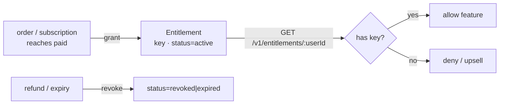

export const metadata = {
  title: 'Gate access with entitlements',
  description: 'Grant access on payment, check it from your module, and revoke on refund or expiry.',
  alternates: { canonical: '/docs/entitlements' },
}

# Gate access with entitlements

An entitlement is a boolean access right: a `key`, a `status`, and a soft link to whatever granted
it. It answers the only question your feature-gate cares about — *does this user have access to X?*
Credits answer "how much have they used" ([metering](/docs/metering-credits)); entitlements answer
"can they at all".



## 1. Decide the key

The entitlement `key` is derived from the **Product's `metadata`** at grant time, in this priority
(identical for one-time and subscription grants):

1. `metadata.entitlements` — a string array → grants one entitlement per key,
2. else `metadata.entitlementKey` — a single string,
3. else the **`product.code`** as a fallback.

So a "Pro" product with `code: "pro"` and no metadata grants the key `pro`. A bundle can grant
several: `metadata.entitlements = ["pro", "api_access", "priority_support"]`.

## 2. It's granted automatically on payment

You don't call a "grant" endpoint. When an order or subscription reaches `paid`, the orchestrator
grants the entitlement(s) and emits `billing.entitlement.granted`. The `value` JSON records the
source:

```json
{ "user_id": "user-123", "key": "pro", "source": "subscription",
  "subscription_id": "sub1", "expires_at": "2026-08-01T00:00:00.000Z" }
```

`source` is `subscription` (recurring; carries `subscription_id` and `expires_at`), `order`
(one-time; carries `order_id`, **never expires**), or `admin`.

## 3. Check access from your module

Read the user's active entitlements and match on `key`. The endpoint returns **only `active`,
non-expired** rows, so presence of the key is the whole check:

```bash
curl https://billing.inite.ai/v1/entitlements/user-123 -H "x-api-key: <service.apiKey>"
```

```json
[{ "key": "pro", "status": "active", "source": "subscription",
   "value": { "subscription_id": "sub1", "product_code": "pro" },
   "expiresAt": "2026-08-01T00:00:00Z" }]
```

```ts
const ents = await billing.get(`/v1/entitlements/${userId}`) // service key
const hasPro = ents.some((e) => e.key === 'pro')
if (!hasPro) return deny()
```

End users check their own with `GET /v1/entitlements/me` (key from their JWT — never trust a
`userId` from the client).

## 4. Prefer events over polling

Rather than calling the API on every request, cache access in your module and keep it fresh from
the [webhook stream](/docs/webhooks):

| Event | Do |
|---|---|
| `billing.entitlement.granted` | mark the user as having `key` (until `expires_at`, if present) |
| `billing.entitlement.revoked` | remove access to `key` |
| `billing.subscription.ended` / `.cancelled` | the related entitlements are revoked — expect a `revoked` event too |

## 5. Revocation is automatic

Entitlements are revoked for you on **refund** (the order-scoped ones) and on **subscription
end/expiry** (the subscription-scoped ones, swept hourly at period end past grace). Each revocation
emits `billing.entitlement.revoked`. You don't revoke manually — you react to the event.

## Next

- [Receive billing events](/docs/webhooks) — wire up grant/revoke handling.
- [Meter AI usage with credits](/docs/metering-credits) — for usage-based access.
