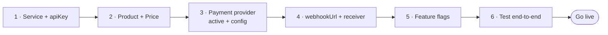

export const metadata = {
  title: 'Go to production',
  description: 'Configure a payment provider, set your webhook URL, flip feature flags, and test end-to-end.',
  alternates: { canonical: '/docs/going-live' },
}

# Go to production

The checklist to take a module from "wired up" to "taking real money". Ordering matters — each step
unblocks the next.



## 1. Service & API key

An admin creates your `Service` (`code`, `name`) and issues an `apiKey`. That key is your module's
`x-api-key`; it's revocable and rotatable from the admin UI. **API keys and provider credentials
are never env vars** — they live in the database.

## 2. Product & price

Create the `Product` (type `subscription` / `one_time` / `usage`) and at least one `Price`
(`amount`, `currency`, `interval`, `trialDays`, `graceDays`). Put access/credit grants on the
product's `metadata`:

- `metadata.entitlements: ["pro"]` (or `metadata.entitlementKey`) — the [entitlement
  keys](/docs/entitlements#1-decide-the-key) to grant.
- `metadata.creditsPerPeriod` / `metadata.credits` — [credits](/docs/metering-credits) to grant.

## 3. Configure a payment provider

Register the rail an admin will take money on. `config` holds the credentials (and, for signed
rails, the secret that also verifies inbound webhooks). A provider is only usable at checkout when
`isActive: true`.

```bash
curl -X POST https://billing.inite.ai/v1/admin/payment-providers \
  -H "Authorization: Bearer <admin-jwt>" -H "Content-Type: application/json" \
  -d '{
    "code": "ONE", "name": "ONE Pay", "isActive": true,
    "supportedModes": ["PAYMENT", "SUBSCRIPTION"], "currencies": ["USD", "BRL"],
    "config": { "apiBaseUrl": "https://api.one.lat", "apiKey": "…", "apiSecret": "…" }
  }'
```

Use `PUT /v1/admin/payment-providers/:id` to flip `isActive`, rotate `config`, or set the provider's
inbound `webhookUrl`. For a dry run, point `apiBaseUrl` at the provider sandbox (e.g.
`https://sandbox.one.lat`).

### lava.top

Cards and СБП in roubles, cards and PayPal in dollars and euros. In **Admin → Payment providers →
Lava.top**:

1. **API key** — lava.top → Integrations → API.
2. **Webhook (recommended, not required).** One-time payments settle without it: the customer pays
   in a window over the checkout, comes back to it, and the checkout asks lava.top; payments whose
   customer never came back are checked in the background every minute (less often as they age)
   and expired after three days unpaid. Subscription renewals, failures and cancellations are read
   from lava.top as each period ends. What *needs* the webhook is refunds and chargebacks — lava.top
   reports them nowhere else. To set it, point lava.top's webhook at
   `https://billing.inite.ai/webhooks/lava`, choose *API key* auth, set any key, and paste the same
   key into **Webhook key** here. (It is not your API key.)
3. **Offers.** lava.top sells *offers* — prices of products created in its dashboard.
   - **One-time payments**: create one product with a **dynamic price** and paste its offer id as the
     **Default offer**. Every one-time price uses it, with the amount sent per invoice — so promo
     discounts work.
   - **Subscriptions**, or a one-time price that should appear as its own product on lava.top: put
     that offer's id in the price's metadata, `Price.metadata.lavaOfferId`. A subscription offer's
     period must match the price's interval (month, 90 days, 180 days, year).
4. Turn the provider on. Prices in RUB, USD or EUR offer it at checkout, with card / СБП / PayPal
   as lava.top carries them for that currency.

Refunds and chargebacks reported by lava.top revoke what the sale granted; cancelling a
subscription here cancels it on lava.top too.

## 4. Webhook URL & receiver

Set your `Service.webhookUrl` (a **public HTTPS** endpoint — private hosts are rejected;
**currently DB-only**, no admin field) and implement the receiver following [Receive billing
events](/docs/webhooks). Make it **idempotent on `x-event-id`** and return `2xx` fast.

## 5. Feature flags

Everything optional ships **dark**. Enable in this order (full detail and verification steps in
[Operations](/docs/operations#feature-flags--rollout-order)):

| Flag | Default | Turns on |
|---|---|---|
| `NOTIFICATIONS_EMAIL_ENABLED` | `false` | outgoing email (needs Resend + verified domain) |
| `OUTREACH_ENABLED` | `false` | AI dunning / win-back / abandoned-checkout |
| `EMBEDDINGS_ENABLED` | `false` | semantic product search (needs `OPENAI_API_KEY`) |
| `RISK_BLOCKING_ENABLED` | `false` | risk scoring **blocks** (monitor-only until then) |
| `RECS_LLM_EXPLAIN` | `false` | LLM explanations on recommendations |

Flags flip without a redeploy (env change + restart). The assistant only needs `ANTHROPIC_API_KEY`.

## 6. Test end-to-end

With no real money (see [Quickstart → Test it locally](/docs/quickstart#test-it-locally-no-money)):

- **100%-off promo** → `paySession` settles instantly via the `PROMO` rail, running full
  fulfilment and firing your webhook.
- **Trial** → `POST /v1/subscriptions/trial` grants access with no payment.

Confirm the whole loop: session created → paid → subscription/entitlement present
(`GET /v1/subscriptions/user/:id`, `/v1/entitlements/:id`) → `billing.*` events received.
Then run one real sandbox payment before flipping the provider to production credentials.

## Referrals

If you run a referral program, attribution is automatic: share links as `…?ref=<code>` and pass the
code as **`referralCode`** on `POST /v1/checkout/sessions`. Billing records the referral on session
create and only creates a commission when the order is **paid** (multi-level, on the discounted
amount). Affiliates manage their own accounts and NET-15 payouts via
`/v1/affiliates/me/{stats,referrals,commissions,payouts,balance,withdraw,tree}`; levels and rates
are configured under `/admin/referral-config`.

## You're live

- Money moves through the [orchestrator](/docs/architecture#payment-state-machine); watch it via
  the `billing.*` [event stream](/docs/webhooks).
- Operational runbook, deploy pipeline, and rollout detail: [Operations](/docs/operations).
