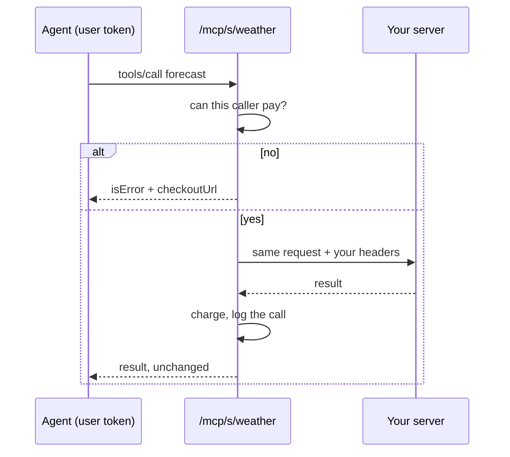

export const metadata = {
  title: 'Charge for your MCP server',
  description:
    'Put your own MCP server behind the billing gateway: per-call credits or an entitlement, a checkout link on refusal, and a call log — without writing billing code.',
  alternates: { canonical: '/docs/mcp-gateway' },
}

# Charge for your MCP server

You run an MCP server. You want to be paid when agents use it, and you don't want to write billing
code. Register it here and agents call it through the gateway at `/mcp/s/<slug>` instead of
directly: the gateway authenticates the caller, decides whether the call is paid for, forwards it
to your server unchanged, and meters what came back.

Your server needs no changes and the agent needs no special client — it is ordinary MCP on both
sides.



## 1. Register the server

With your service key. The server is filed under the service the key belongs to — never a value
from the request — so a key can't register or read anybody else's.

```bash
curl -X POST https://billing.inite.ai/v1/mcp/servers \
  -H "x-api-key: <service.apiKey>" -H "Content-Type: application/json" \
  -d '{
    "slug": "weather",
    "name": "Weather tools",
    "upstreamUrl": "https://tools.example.com/mcp",
    "upstreamHeaders": { "Authorization": "Bearer <your own upstream secret>" },
    "pricingMode": "per_call",
    "creditsPerCall": 2,
    "priceCode": "credits-100"
  }'
```

| Field | |
|---|---|
| `slug` | The path agents call: `/mcp/s/<slug>`. 3–64 lowercase letters, digits and hyphens. Shared namespace, first come first served. |
| `upstreamUrl` | Your server. Must be publicly reachable — private, loopback and metadata addresses are refused at registration, and checked again on every call because DNS can change. |
| `upstreamHeaders` | Sent to your server with every call, for your own auth. **Written, never returned** — reads show only the header names. On update, headers are merged; send `null` for a key to remove it. |
| `pricingMode` | `per_call` (default), `entitlement` or `free`. |
| `creditsPerCall` | Flat price for `per_call`. |
| `featureCode` | Charge through a [metered feature](/docs/metering-credits) instead: one call is one unit, and the feature's rate, quotas and soft caps apply. |
| `requiredEntitlement` | For `entitlement` pricing: the key a caller must hold. |
| `priceCode` | What to sell a caller who can't pay. The refusal carries a checkout link for it. |

List, read, change and remove with `GET`, `GET /:id`, `PATCH /:id` and `DELETE /:id` on the same
path. Everything that would otherwise fail on the first call — a bad slug, a private URL, a
`per_call` server with no price — is refused here, while you're looking.

## 2. Point agents at it

```jsonc
{
  "mcpServers": {
    "weather": {
      "url": "https://billing.inite.ai/mcp/s/weather",
      "headers": { "Authorization": "Bearer <user token>" }
    }
  }
}
```

The gateway charges **a person**, so it takes a user token. A service key is refused with
`403`: it names no customer to bill or to log the call against. A module acting for its own
customers uses the [billing tools](/docs/mcp) instead, where it says who it's acting for.

## What is charged, and when

- **Discovery is free**: `initialize`, `ping`, `tools/list`, `resources/list`, `prompts/list`.
  Charging for them would break every client that connects.
- **Authorised before** your server is touched. A caller who can't pay never costs you a request.
- **Charged after** your server answered successfully. A customer is never billed for a server
  that was down or returned an error.
- **Credits land on your service's balance** for that customer, the same balance your other
  products debit.

Between the check and the charge, a burst of concurrent calls can each pass and only some find
credits left. Those were already answered; they're logged as `unpaid` rather than failed after
the fact. That direction is chosen: the customer got what they asked for, and you lost a few
credits — better than collecting for work that never happened.

## A refusal the agent can act on

When a caller can't pay, the answer is a JSON-RPC **result** with `isError`, not a protocol error
— so the agent can read it, show the link, and try again after paying:

```json
{
  "jsonrpc": "2.0",
  "id": 7,
  "result": {
    "isError": true,
    "content": [{ "type": "text", "text": "This call costs 2 credit(s) and the account has 0.\n\nTop up here, then call again: https://…/checkout/…" }],
    "structuredContent": { "payment_required": true, "checkoutUrl": "https://…/checkout/…" }
  }
}
```

Without a `priceCode` the refusal carries the explanation and no link.

## The call log

Every call is recorded — including the ones nobody paid for, because you can't tell a pricing
mistake from a quiet week without them.

| Outcome | Meaning |
|---|---|
| `ok` | Answered and charged. |
| `free` | A discovery call, or a `free` server. |
| `denied` | The caller couldn't pay and was turned away before your server was called. |
| `upstream_error` | Your server failed or timed out. Nobody was charged. |
| `unpaid` | Your server answered, and the charge failed afterwards. |

```bash
curl "https://billing.inite.ai/v1/mcp/servers/<id>/usage?days=30" -H "x-api-key: <service.apiKey>"
```

```json
{ "slug": "weather", "since": "2026-08-26T00:00:00.000Z",
  "calls": { "ok": 412, "free": 96, "denied": 17, "unpaid": 2 },
  "creditsCharged": 824,
  "recent": [{ "userId": "user-123", "method": "tools/call", "toolName": "forecast",
               "outcome": "ok", "creditsCharged": 2, "latencyMs": 184 }] }
```

Platform admins see every operator's servers, their traffic and the latest calls under
**Admin → MCP gateway**, and can register or switch off a server on an operator's behalf.

## Limits

- Stateless: every request is a `POST`; `GET` and `DELETE` get `405`.
- Your server has 30 seconds to answer, and a response is capped at 1 MB.
- Only string header values with ordinary header names are forwarded.

## Next

- [Billing tools for agents](/docs/mcp) — the billing service's own MCP tools.
- [Meter AI usage with credits](/docs/metering-credits) — rates, tiers and quotas behind `featureCode`.
