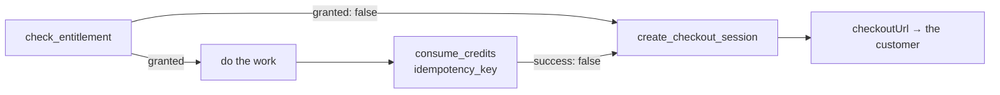

export const metadata = {
  title: 'Billing tools for agents (MCP)',
  description:
    'Check entitlements, charge credits and hand back a checkout link from inside an agent — over MCP, at /mcp or through the stdio package.',
  alternates: { canonical: '/docs/mcp' },
}

# Billing tools for agents (MCP)

The billing service speaks [Model Context Protocol](https://modelcontextprotocol.io). An agent can
ask whether a customer may have something, charge them for the work, and — when they can't pay —
get back a URL to send them to. Same rules, same ledger and same tenant scoping as the REST API;
the tools are thin calls into the modules that already implement it.



## Connect

Two transports, one set of tools. Pick whichever your client supports.

**Over HTTP** — point any MCP client at the endpoint. It is stateless Streamable HTTP: every
request is a `POST`, there is no session to keep.

```jsonc
{
  "mcpServers": {
    "inite-billing": {
      "url": "https://billing.inite.ai/mcp",
      "headers": { "x-api-key": "<service.apiKey>" }
    }
  }
}
```

**Over stdio** — for clients that only launch local processes (Claude Desktop, Cursor). The
package is a bridge that forwards to the same endpoint, so it never lags behind the service.

```jsonc
{
  "mcpServers": {
    "inite-billing": {
      "command": "npx",
      "args": ["-y", "@inite/billing-mcp"],
      "env": { "INITE_API_KEY": "<service.apiKey>" }
    }
  }
}
```

| Variable | |
|---|---|
| `INITE_API_KEY` | A service key. |
| `INITE_JWT` | A user token instead of a key. |
| `INITE_BILLING_URL` | Defaults to `https://billing.inite.ai`. Credentials are refused over plain HTTP unless the host is `localhost`. |

## Who the work is done for

The credential decides, not the arguments.

- **Service key** — the module acts for its own customers and must name one with `user_id`. It sees
  only its own service's entitlements, catalogue and balances, and charges land on its balance.
- **User token** — acts for that user. A `user_id` argument is **ignored**, not honoured: an agent
  will happily pass an id it read somewhere, and this is the boundary that stops it.

## Tools

| Tool | Read-only | What it answers |
|---|---|---|
| `check_entitlement` | yes | Does this customer hold `key` right now? `granted: false` rather than an error. |
| `list_entitlements` | yes | Everything they currently hold. |
| `get_credit_balance` | yes | What is left — the service's balance for a key, every balance for a user. |
| `consume_credits` | no | Debit for work done: flat `amount`, or `feature_code` + `units` for [metered](/docs/metering-credits) rates and quotas. |
| `create_checkout_session` | no | Opens a purchase for `price_code` and returns `checkoutUrl`. |
| `list_catalog` | yes | Products and prices. |
| `list_subscriptions` | yes | Their subscriptions and where each is in its lifecycle. |

Read-only tools carry the `readOnlyHint` annotation, so a client may call them without asking.

### Pass an `idempotency_key` to `consume_credits`

Agents retry. A model re-calls a tool whose answer it did not see; a transport times out and tries
again. Without a key each of those is a second debit against a real customer. With one the ledger
records the charge once, and every repeat returns the same remaining balance without debiting again.

Derive it from the unit of work — the request id, the message id, a hash of the inputs. A fresh
random value per attempt defeats the point.

```json
{
  "name": "consume_credits",
  "arguments": {
    "user_id": "user-123",
    "feature_code": "llm_tokens",
    "units": 15000,
    "idempotency_key": "msg_01HZX…"
  }
}
```

## Failures are answers, not errors

A tool that can't do what was asked returns its result with `isError: true` and a sentence the
model can act on — "not enough credits", "no such price" — instead of a JSON-RPC error that would
end the agent's turn. Not having enough credits isn't even that: `consume_credits` returns
`success: false` with the remaining balance, the same as [the REST
endpoint](/docs/metering-credits), and the natural next call is `create_checkout_session`.

## Next

- [Charge for your MCP server](/docs/mcp-gateway) — put somebody else's tools behind the same billing.
- [Meter AI usage with credits](/docs/metering-credits) — rates, tiers and quotas behind `feature_code`.
