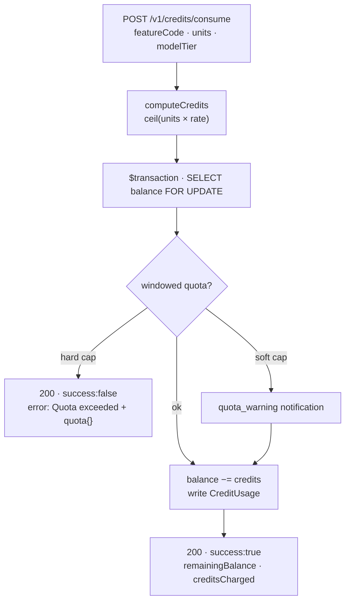

export const metadata = {
  title: 'Meter AI usage with credits',
  description: 'Charge per token, request, or generation with model-tier rates and quotas — from your module.',
  alternates: { canonical: '/docs/metering-credits' },
}

# Meter AI usage with credits

Credits are an integer balance per user (optionally scoped to your service). You grant them on
payment and **debit** them as usage happens — with per-model-tier rates and windowed quotas.
This is how INITE modules bill usage-based / pay-as-you-go AI features.



## 1. Get credits onto the balance

Credits arrive one of three ways:

- **On payment** — put `metadata.creditsPerPeriod` (subscriptions, reset each period) or
  `metadata.credits` (one-time, added) on the Product. Fulfilment grants them automatically.
- **Admin adjust** — `POST /v1/credits/adjust` (service key only) with a signed `amount`.
- **Trial** — trial subscriptions grant their period credits with no payment.

## 2. Register a metered feature

An admin defines each billable action once as a `MeteredFeature`: a `code`, a `unit`
(`tokens` / `requests` / `generations` / `seconds`), a base `creditsPerUnit`, and optional
`tierRates` that override the rate per model tier. Fetch the live registry any time:

```bash
curl https://billing.inite.ai/v1/credits/features -H "x-api-key: <service.apiKey>"
```

```json
[{ "code": "llm_tokens", "unit": "tokens", "creditsPerUnit": "0.001000",
   "tierRates": { "gpt-4o": 0.005, "haiku": 0.0005 }, "isActive": true,
   "service": { "code": "chat", "name": "Chat" } }]
```

Credits charged = `ceil(units × rate)`, where `rate = tierRates[modelTier]` if present, else
`creditsPerUnit`.

## 3. Debit as usage happens

Call `consume` after each unit of work. Two modes, selected by whether `featureCode` is present:

```bash
# Metered — the normal AI path
curl -X POST https://billing.inite.ai/v1/credits/consume \
  -H "x-api-key: <service.apiKey>" -H "Content-Type: application/json" \
  -d '{ "userId": "user-123", "featureCode": "llm_tokens", "units": 15000, "modelTier": "haiku" }'
```

```json
{ "success": true, "remainingBalance": 900, "creditsCharged": 8 }
```

```bash
# Flat — legacy, deduct a fixed amount
curl -X POST https://billing.inite.ai/v1/credits/consume \
  -H "x-api-key: <service.apiKey>" -H "Content-Type: application/json" \
  -d '{ "userId": "user-123", "amount": 5 }'
```

```json
{ "success": true, "remainingBalance": 895 }
```

## 4. Handle the not-enough cases — they return 200, not an error

`consume` never throws for business reasons. Insufficient balance and quota hits are **HTTP 200**
with `success: false` — check the flag, don't rely on status codes:

```json
// out of credits
{ "success": false, "remainingBalance": 3, "error": "Insufficient credits" }

// quota exceeded (metered hard cap)
{ "success": false, "remainingBalance": 900, "error": "Quota exceeded",
  "quota": { "window": "day", "limitUnits": 1000, "usedUnits": 1000, "limitCredits": null, "usedCredits": 500 } }
```

> The response field is always **`remainingBalance`** (never `balance`), and **`creditsCharged`
> appears only in metered mode**.

## 5. Quotas

Quotas are optional caps evaluated **inside** the consume transaction under a balance row lock, so
concurrent calls can't race past them. They're per-feature or balance-wide, over a `day` / `week` /
`month` / `billing_period` window, denominated in units or credits, with per-user overrides and a
`block` (hard cap → the 200-with-`success:false` above) or `notify_only` policy. Soft-cap crossings
send a `quota_warning` notification (deduped per window). Manage them under `/admin/metering`.

## Reading balances

```bash
curl https://billing.inite.ai/v1/credits/user-123 -H "x-api-key: <service.apiKey>"
```

```json
[{ "serviceId": "svc1", "balance": 900, "totalGranted": 1000, "totalUsed": 100,
   "resetsAt": "2026-08-01T00:00:00Z", "service": { "code": "chat", "name": "Chat" } }]
```

Users see their own via `GET /v1/credits/me` and a per-feature breakdown at
`GET /v1/credits/me/usage/breakdown`.

## Next

- [Gate access with entitlements](/docs/entitlements) — the boolean-access counterpart to credits.
- [Receive billing events](/docs/webhooks) — react to grants and resets.
