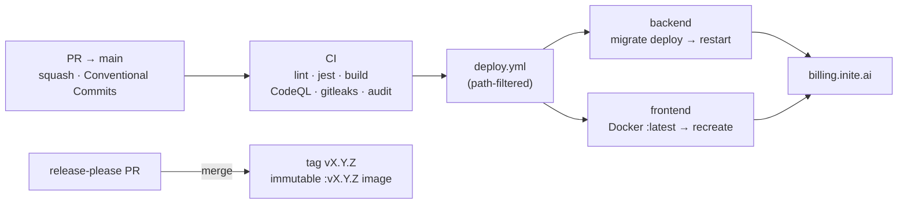
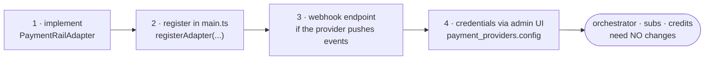

export const metadata = {
  title: 'Operations',
  description: 'Deploy pipeline, feature-flag rollout, runbook notes, and adding a rail.',
  alternates: { canonical: '/docs/operations' },
}

# Operations

Deploying, flipping feature flags safely, and extending the service.

## Deploy pipeline

- **Branch flow**: `main` is PR-only (branch protection; `build-test` is a
  required check, admins included). Squash-merge titles follow Conventional
  Commits — release-please parses them.
- **On merge to main**: `.github/workflows/deploy.yml` runs CI, then deploys
  backend/frontend to `billing.inite.ai` (path-filtered — only what changed).
- **Releases**: release-please maintains a release PR; merging it tags
  `vX.Y.Z`, updates `CHANGELOG.md`, and builds the immutable Docker image
  (`:vX.Y.Z`, `:X.Y`) via `release-image.yml` — releases do **not** tag `:latest`
  (that tracks the rolling `main` deploy only)
  (needs `DOCKERHUB_USERNAME` / `DOCKERHUB_TOKEN` secrets).
- **CI safety net**: lint, build, full jest suite against pgvector
  postgres + redis services, frontend typecheck+build, docker build, npm
  audit, CodeQL, gitleaks (full history), dependency review, scorecard.



## Database

- Postgres must support the `vector` extension (`pgvector/pgvector` image, or
  RDS/Cloud SQL/Neon which ship it). **Verify before deploying the embeddings
  migration** — `prisma migrate deploy` runs `CREATE EXTENSION vector`. Local
  compose / CI use `pgvector/pgvector:pg15`; the shared production Postgres runs
  `pgvector/pgvector:pg14`.
- Migrations are append-only and applied automatically on boot
  (`prisma migrate deploy`).
- Backups: the `billing` schema is the money ledger — treat it accordingly.

## Feature flags & rollout order

Everything new ships **dark**. Recommended enable order:

| Step | Flag(s) | Prerequisites | Verify |
|---|---|---|---|
| 1. Assistant | `ANTHROPIC_API_KEY` (+`ANTHROPIC_MODEL`) | — | chat streams in dashboard; `assistant_tool_calls` rows appear |
| 2. Email | `NOTIFICATIONS_EMAIL_ENABLED=true`, `RESEND_API_KEY`, `EMAIL_FROM` | Resend account, domain verified (SPF+DKIM), `RESEND_WEBHOOK_SECRET` + webhook `POST /v1/notifications/webhooks/resend` | `POST /v1/admin/outreach/test-email` lands in an inbox; delivery status flips to `delivered` |
| 3. Outreach | `OUTREACH_ENABLED=true`, `OUTREACH_TRIGGERS=abandoned_checkout` | step 2 | `/admin/outreach` shows sends; then add `dunning,winback,trial_ending` |
| 4. Embeddings | `EMBEDDINGS_ENABLED=true`, `OPENAI_API_KEY` | pgvector live | `GET /v1/products/search?q=` returns scored results |
| 5. Risk blocking | `RISK_BLOCKING_ENABLED=true` | weeks of monitor-only data; check false-positive rate in `/admin/risk/stats` | flagged checkouts blocked |
| optional | `RECS_LLM_EXPLAIN=true` | — | offer cards show one-line explanations |

Kill switches work instantly — flipping a flag off stops the surface without
redeploys (env change + restart).

## Ops runbook notes

- **Outreach spend**: worst case is bounded by processor concurrency (2) and
  `max_tokens 600`; watch the template-fallback rate on `/admin/outreach` —
  a spike means the Anthropic API is failing and only templates go out.
- **Email reputation**: bounces/complaints auto-suppress the contact
  (`user_contacts.email_suppressed`); the unsubscribe link sets per-category
  preferences. Dunning is treated as transactional.
- **Stuck jobs**: BullMQ queues (`webhooks`, `outbox`, `notifications`,
  `outreach`, `embeddings`, `affiliate-payouts`) retry with exponential
  backoff; failed notification rows keep `lastError`.
- **Assistant abuse**: chat is throttled 10/min/user; the tool loop caps at 5
  iterations; admin tools require the `admin` role from the JWT.
- **Provider credentials** live in `payment_providers.config` — rotate via
  the admin UI, not env.

## Adding a payment rail

1. Implement the `PaymentRailAdapter` interface (`src/adapters/`):

```typescript
export class NewRailAdapter implements PaymentRailAdapter {
  rail(): string { return 'NEW_RAIL'; }
  async createPaymentIntent(input: CreateIntentInput): Promise<CreateIntentResult> { /* ... */ }
  async getIntentStatus(providerIntentId: string): Promise<IntentStatusResult> { /* ... */ }
}
```

2. Register it in `main.ts` (`orchestrator.registerAdapter(...)`).
3. Add a webhook endpoint in `src/webhooks/` if the provider pushes events —
   store to `webhook_events` and let the BullMQ processor validate and apply.
4. Add provider credentials via the admin UI (`payment_providers`).



The orchestrator, subscriptions, credits and entitlements need **no changes**
— that's the point of the adapter boundary.

## Affiliate program

Self-service: users create an affiliate account, share `?ref=CODE` links,
earn configurable multi-level commissions on referred payments; payouts are
generated NET-15 monthly by the daily cron and paid via payout providers.
Levels/rates are configured at `/admin/referral-config`.
