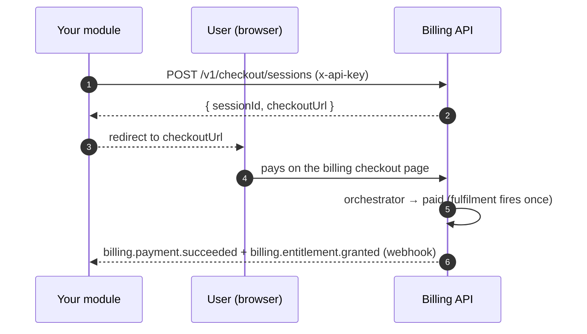

export const metadata = {
  title: 'Sell your first subscription',
  description: 'End-to-end: from a product and price to a paid subscription, a live entitlement, and a webhook.',
  alternates: { canonical: '/docs/quickstart' },
}

# Sell your first subscription

This is the happy path from your module's point of view: a user starts checkout, pays, and comes
back with an active subscription, a granted entitlement, and a `billing.payment.succeeded` event
delivered to your webhook. It assumes you've read [Core concepts](/docs/concepts).



## Before you start

You need three things, all created once by an admin:

1. A **Service** with an API key (`x-api-key`) — this is your module's identity.
2. A **Product** and a **Price** (with `interval: month`, an optional `trialDays`, a `graceDays`).
3. At least one **active payment provider** — or, for a first test with no real money, a
   **100%-off promo** (see [Test it locally](#test-it-locally-no-money)).

Optionally set your Service's `webhookUrl` so you receive events (see
[Receive billing events](/docs/webhooks)).

## 1. Create a checkout session

Your module calls this server-to-server with its API key. `checkoutUrl` is the **billing checkout
page** you redirect the user to — not a provider URL (the provider is chosen at the pay step).

```bash
curl -X POST https://billing.inite.ai/v1/checkout/sessions \
  -H "x-api-key: <service.apiKey>" \
  -H "Content-Type: application/json" \
  -H "idempotency-key: order-42" \
  -d '{
    "priceCode": "pro_monthly",
    "mode": "SUBSCRIPTION",
    "userId": "user-123",
    "successUrl": "https://your-app.example/billing/success",
    "errorUrl": "https://your-app.example/billing/cancelled"
  }'
```

```json
{ "sessionId": "b2c1…uuid", "checkoutUrl": "https://billing.inite.ai/checkout/b2c1…uuid" }
```

- `mode` is `SUBSCRIPTION` for recurring, `PAYMENT` for one-time. It must match the product type.
- `userId` is required only for **service** callers (an end-user JWT derives it from the token).
- The `idempotency-key` header makes retries safe — the same key returns the same session for 1h.
- Pass `referralCode` here to attribute an affiliate (see [Referrals](/docs/going-live#referrals)).

Redirect the user to `checkoutUrl`.

## 2. The user pays

On the billing checkout page the user picks a method and pays. Under the hood that page calls
`POST /v1/checkout/sessions/:id/pay` (an end-user action), which either hands off to the provider's
hosted page or, for a fully-discounted order, settles instantly. You don't implement this step —
it's the billing frontend — but it's where the money actually moves.

## 3. Fulfilment fires once

When the payment reaches `paid`, the [orchestrator](/docs/architecture#payment-state-machine) runs
every side effect exactly once, inside one transaction:

- the **Subscription** is created (`trialing` if the price has trial days, else `active`),
- the **Entitlement**(s) for the product are granted,
- any **credits** on the product are granted / reset for the period,
- an **Invoice** is written, and
- `billing.payment.succeeded` + `billing.entitlement.granted` are emitted to your webhook.

## 4. Confirm access

React to the webhook in production. To verify directly (service key):

```bash
# Active subscription for the user
curl https://billing.inite.ai/v1/subscriptions/user/user-123 -H "x-api-key: <service.apiKey>"
# Active entitlements — match on `key` to gate features
curl https://billing.inite.ai/v1/entitlements/user-123 -H "x-api-key: <service.apiKey>"
```

```json
// entitlements/:userId → only active, non-expired
[{ "key": "pro", "status": "active", "source": "subscription",
   "value": { "subscription_id": "sub1", "product_code": "pro" },
   "expiresAt": "2026-08-01T00:00:00Z" }]
```

Gate your feature on the entitlement `key` — see [Gate access with
entitlements](/docs/entitlements).

## Test it locally (no money)

There's no mock payment rail, but two paths complete the whole flow with zero provider calls:

- **100%-off promo** — create a promo code that discounts the price to `0`, then pass it at the
  pay step. `paySession` sees `amount === 0`, creates a `PROMO` intent, and immediately transitions
  it to `paid` — full fulfilment, no provider. Great for wiring up your webhook handler.
- **Trial** — `POST /v1/subscriptions/trial` with `{ "priceCode": "pro_monthly", "userId": "…" }`
  grants entitlements and trial credits with no payment at all (the price needs `trialDays > 0`).

> Provider sandboxes also exist (e.g. ONE `sandbox.one.lat`) — set them in the provider `config`
> for a realistic dry run. See [Go to production](/docs/going-live).

## Next

- [Meter AI usage with credits](/docs/metering-credits)
- [Receive billing events](/docs/webhooks)
- [Go to production](/docs/going-live)
