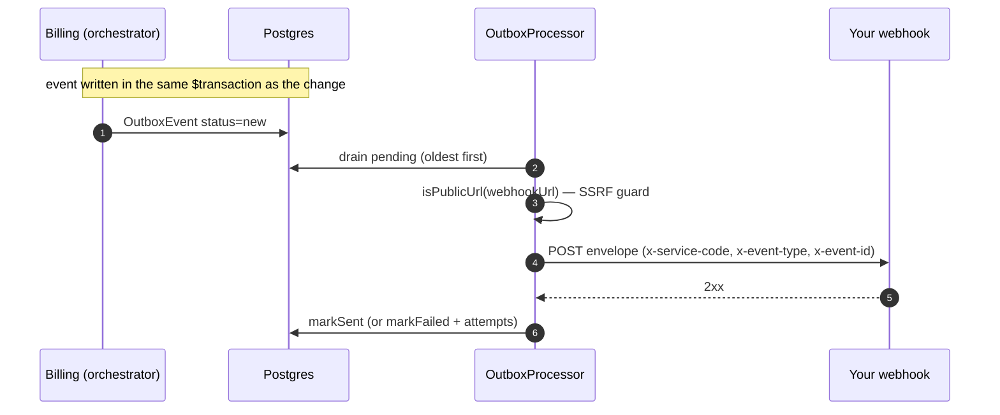

export const metadata = {
  title: 'Receive billing events',
  description: 'Subscribe to billing.* events — the envelope, delivery guarantees, verification, and idempotency.',
  alternates: { canonical: '/docs/webhooks' },
}

# Receive billing events

Billing pushes every state change your module needs to know about — a payment succeeded, an
entitlement was granted or revoked, a subscription changed — to your webhook. React to these
instead of polling.



## 1. Set your webhook URL

Delivery targets your `Service.webhookUrl`. Two constraints that trip people up:

- It must be a **public HTTPS host.** The outbox has an SSRF guard that rejects `localhost`,
  loopback, private, and link-local addresses — so a `localhost` URL will silently never receive
  events. For local development, use a tunnel (e.g. an ngrok-style public URL).
- **There is currently no admin API to set `Service.webhookUrl`** — it's set directly in the
  database (or a seed). This is a deliberate flag in these docs; don't look for a
  `PUT /v1/admin/services` field for it (that endpoint sets `code`/`name`/`isActive`/`metadata`
  only; its `webhookUrl` belongs to payment *providers*, a different object).

## 2. The envelope

Every event is the same JSON shape, with three headers:

```
x-service-code: <your service.code>
x-event-type:   <event type, e.g. billing.payment.succeeded>
x-event-id:     <unique event id — use for idempotency>
```

```json
{
  "type": "billing.payment.succeeded",
  "data": { "order_id": "…", "user_id": "user-123", "amount": "20.0000", "currency": "USD" },
  "aggregate": {},
  "eventId": "…uuid",
  "timestamp": "2026-07-26T12:00:00.000Z"
}
```

`data` keys are **snake_case**. `aggregate` is present for envelope symmetry but is empty today.

## 3. Event catalog

The events you'll act on most, with their `data`:

| `type` | `data` |
|---|---|
| `billing.payment.succeeded` | `{ order_id, user_id, amount, currency }` |
| `billing.payment.refunded` | `{ order_id, user_id, amount, currency }` |
| `billing.entitlement.granted` | `{ user_id, key, source, order_id? \| subscription_id?, expires_at?, trial? }` |
| `billing.entitlement.revoked` | `{ user_id, key, … }` |
| `billing.subscription.updated` / `.cancelled` / `.ended` | subscription id + status |
| `billing.subscription.payment_failed` | dunning signal for a renewal |
| `billing.subscription.trial_started` | a trial began |
| `billing.payment.status_changed` | `{ payment_intent_id, order_id, status, previous_status }` |

For access control you mostly need `entitlement.granted` / `entitlement.revoked` (see
[Gate access with entitlements](/docs/entitlements)).

## 4. Verify and de-duplicate

Two properties to design for:

- **No signature.** Outbound webhooks are **not signed** — the trust signals are TLS and the
  `x-service-code` header. Terminate TLS, and treat the endpoint as unauthenticated: don't act on
  anything you can't re-verify against the API if it matters. (You can also firewall the endpoint to
  billing's egress.)
- **At-least-once delivery.** A failed POST is retried, so the same `eventId` can arrive more than
  once. **Make your handler idempotent** — dedupe on `eventId` (store processed ids; ignore repeats).

```ts
app.post('/billing/webhook', async (req, res) => {
  const eventId = req.header('x-event-id')
  if (await seen(eventId)) return res.sendStatus(200)   // idempotent
  const { type, data } = req.body
  switch (type) {
    case 'billing.entitlement.granted': await grant(data.user_id, data.key, data.expires_at); break
    case 'billing.entitlement.revoked': await revoke(data.user_id, data.key); break
    case 'billing.payment.succeeded':   await recordPayment(data); break
  }
  await markSeen(eventId)
  res.sendStatus(200)  // 2xx = delivered; non-2xx makes billing retry
})
```

Return `2xx` once you've durably accepted the event. A non-2xx (or timeout — the POST has a 10s
budget) marks the delivery failed and it will be retried.

## Next

- [Gate access with entitlements](/docs/entitlements)
- [Go to production](/docs/going-live)
